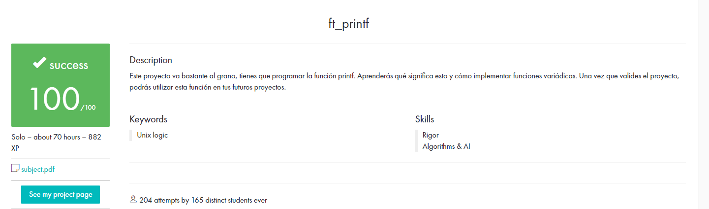

#Makefile
I didn't want to take a long time on the Makefile so instead of adding <libft.h> I decided to add the needed functions as additional files (project has no limit for .c/.h files).

I will rework this in the future for cleaner code, and maybe for bonus.

#Score
No bonus this time :(

